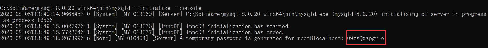

## MySql

### 一、解压压缩包

### 二、配置环境变量

```
path中直接添加
```

### 三、创建my.ini

```
[mysqld]
# 设置3306端口
port=3306
# 设置mysql的安装目录
basedir=C:\Program Files\MySQL
# 设置mysql数据库的数据的存放目录
datadir=C:\Program Files\MySQL\Data
# 允许最大连接数
max_connections=200
# 允许连接失败的次数。
max_connect_errors=10
# 服务端使用的字符集默认为utf8mb4
character-set-server=utf8mb4
# 创建新表时将使用的默认存储引擎
default-storage-engine=INNODB
# 默认使用“mysql_native_password”插件认证
#mysql_native_password
default_authentication_plugin=mysql_native_password
[mysql]
# 设置mysql客户端默认字符集
default-character-set=utf8mb4
[client]
# 设置mysql客户端连接服务端时默认使用的端口
port=3306
default-character-set=utf8mb4
```

### 四、安装步骤

```
用管理员身份运行cmd进入mysql文件夹bin目录
mysqld --initialize --console初始化密码
```



```
安装及启动mysql服务
mysqld --install [服务名]		服务名可不加，默认为mysql
net start mysql		启动mysql服务
```

最后打开navicat连接后会自动让改密码，一般设为123456

```
MySQL的启动和关闭
1.Windows下
启动服务
mysqld --console　　
或　　net start mysql　　

关闭服务
mysqladmin -uroot shudown　　
或　　net stop mysql　　

2.Linux下
启动服务
service mysql start　　　

关闭服务
service mysql stop　　

重启服务
service restart stop
```

### 五、语句

