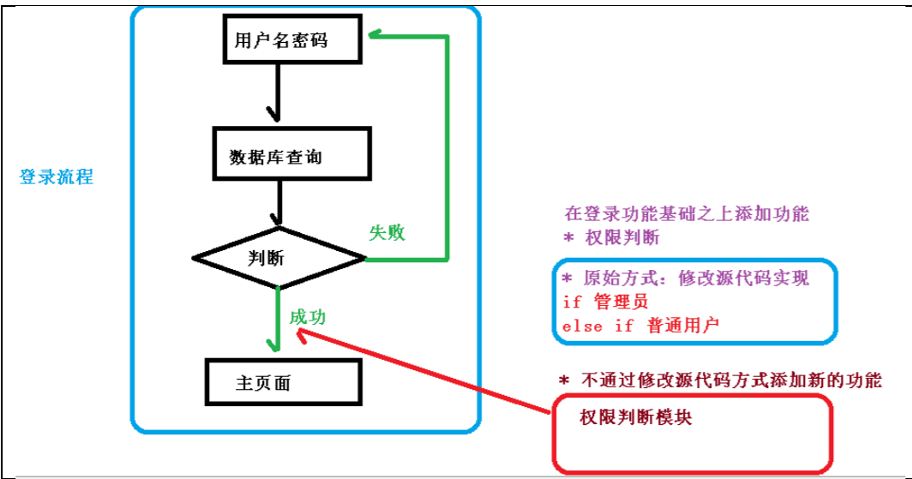
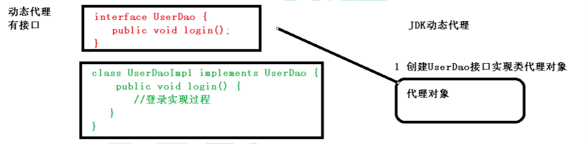
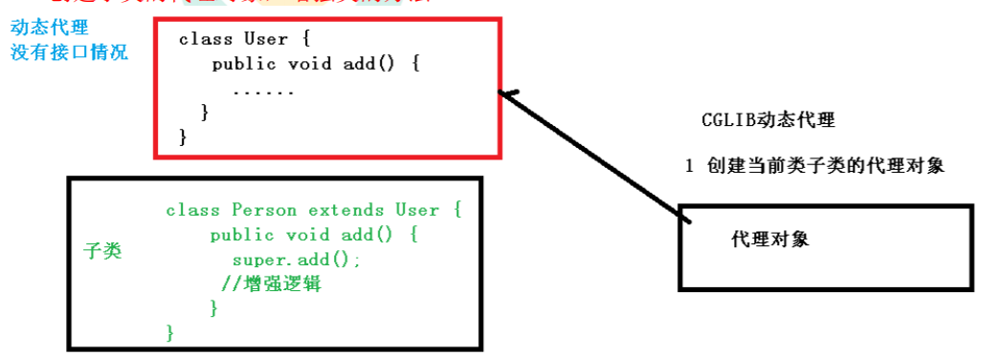
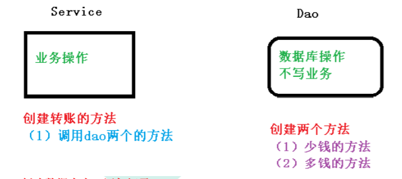
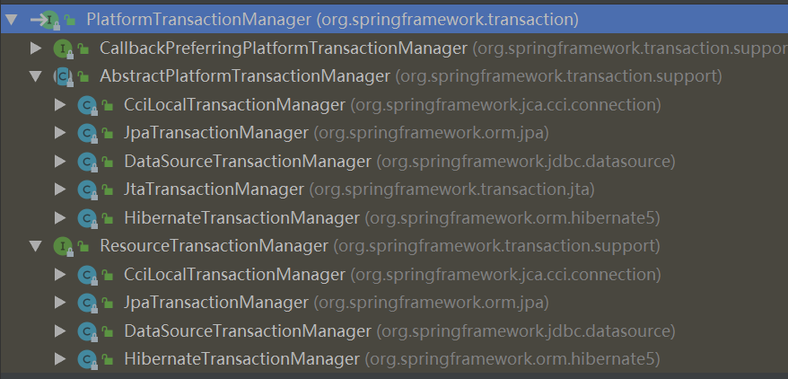
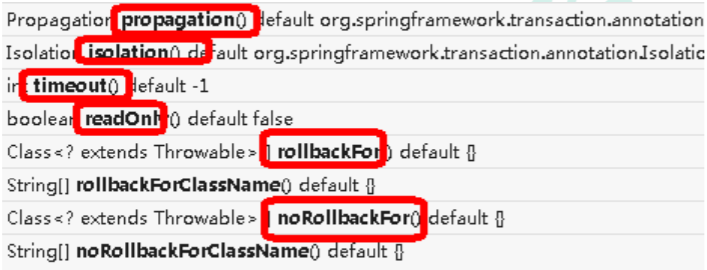
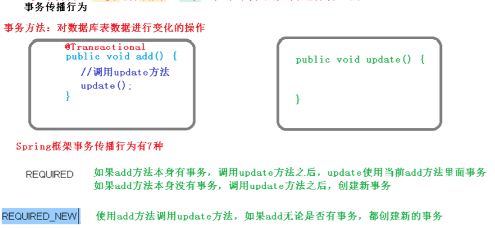
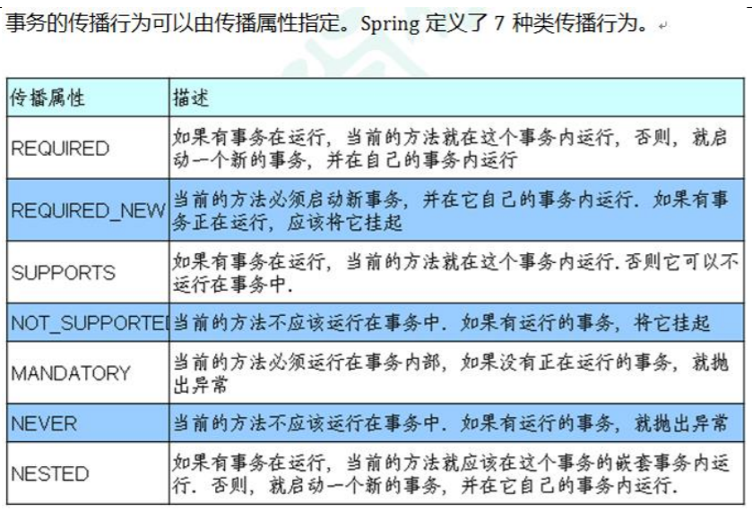
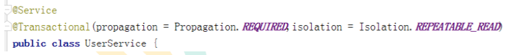
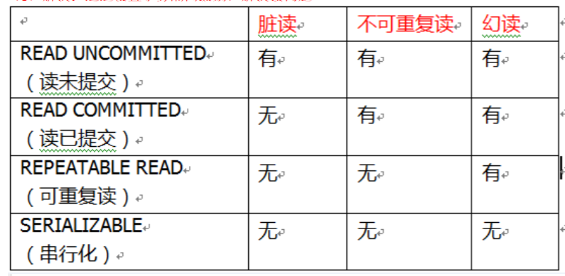

# Spring5

## 一、课程内容介绍

1、Spring 框架概述 
2、IOC 容器
（1）IOC 底层原理
（2）IOC 接口（BeanFactory，ApplicationContext）
（3）IOC 操作 Bean 管理（基于 xml）
（4）IOC 操作 Bean 管理（基于注解）
3、Aop
4、JdbcTemplate
5、事务管理
6、Spring5 新特性

## 二、Spring5 框架概述

1、Spring 是轻量级的开源的 JavaEE 框架
2、Spring 可以解决企业应用开发的复杂性
3、Spring 有两个核心部分：Ioc 和 Aop
（1）IOC：控制反转，把创建对象过程交给 Spring 进行管理
（2）AOP：面向切面，不修改源代码进行功能增强
4、Spring 特点
（1）方便解耦，简化开发
（2）Aop 编程支持
（3）方便程序测试
（4）方便和其他框架进行整合
（5）方便进行事务操作
（6）降低 API 开发难度

### 1、IOC

#### 1、IOC（概念和原理）

```
（1）控制反转，把对象创建和对象之间的调用过程，交给 Spring 进行管理
（2）使用 IOC 目的：为了耦合度降低
（3）做**入门案例**就是 IOC 实现
```

#### 2、IOC 底层原理

```
（1）xml 解析、工厂模式、反射
	画图讲解 IOC 底层原理
```


#### 3、IOC（BeanFactory ApplicationContext接口）

1、IOC 思想基于 IOC 容器完成，IOC 容器底层就是对象工厂
2、Spring 提供 IOC 容器实现两种方式：（两个接口）
（1）BeanFactory：IOC 容器基本实现，是 Spring 内部的使用接口，不提供开发人员进行使用
*加载配置文件时候不会创建对象，在获取对象（使用）才去创建对象
（2）ApplicationContext：BeanFactory 接口的子接口，提供更多更强大的功能，一般由开发人
员进行使用
*加载配置文件时候就会把在配置文件对象进行创建
3、ApplicationContext 接口有实现类（Ctrl+h）

```java
ClassPathXmlApplicationContext
FileSystemXmlApplicationContext
```

#### 4、IOC 操作 Bean 管理（xml方式）

```
1、什么是 Bean 管理
（0）Bean 管理指的是两个操作
（1）Spring 创建对象
（2）Spirng 注入属性
2、Bean 管理操作有两种方式
（1）基于 xml 配置文件方式实现
（2）基于注解方式实现
```

##### 1、IOC 操作 Bean 管理（一般属性）

- 基于 xml 方式创建对象

  （1）在 spring 配置文件中，使用 bean 标签，标签里面添加对应属性，就可以实现对象创建
  （2）在 bean 标签有很多属性，介绍常用的属性

  ​			id 属性：唯一标识

  ​			class 属性：类全路径（包类路径）

  （3）创建对象时候，默认也是执行无参数构造方法完成对象创建

- 基于 xml 方式注入属性

  **DI：依赖注入，就是注入属性**

  ***IOC和DI的区别：DI是IOC中的一种具体实现，表示依赖注入，需要在创建对象的基础之上完成***

  1. 使用 set 方法进行注入

     - 创建类，定义属性和对应的 set 方法

     - 在 spring 配置文件配置对象创建，配置属性注入

       ```xml
       <!--2 set 方法注入属性-->
       <bean id="book" class="com.atguigu.spring5.Book">
        	<!--使用 property 完成属性注入
       	 name：类里面属性名称
       	 value：向属性注入的值
            -->
            <property name="bname" value="易筋经"></property>
            <property name="bauthor" value="达摩老祖"></property>
       </bean>
       ```

  2. 使用有参数构造进行注入

     - 创建类，定义属性，创建属性对应有参数构造方法

     - 在 spring 配置文件中进行配置

       ```xml
       <!--3 有参数构造注入属性-->
       <bean id="orders" class="com.atguigu.spring5.Orders">
            <constructor-arg name="oname" value="电脑"></constructor-arg>
            <constructor-arg name="address" value="China"></constructor-arg>
       </bean>
       ```

  3. p 名称空间注入（了解）
  
- xml 注入其他类型属性

  1. 字面量

     ```
     - null
     - 属性值包含特殊符号
     ```

  2. 注入属性-外部 bean

     （1）创建两个类 service 类和 dao 类
     （2）***在 service 调用 dao 里面的方法***
     （3）在 spring 配置文件中进行配置

     ```xml
     <!--1 service 和 dao 对象创建-->
     <bean id="userService" class="com.atguigu.spring5.service.UserService">
         <!--注入 userDao 对象
         name 属性：类里面属性名称
         ref 属性：创建 userDao 对象 bean 标签 id 值
         -->
     	<property name="userDao" ref="userDaoImpl"></property>
     </bean>
     <bean id="userDaoImpl" class="com.atguigu.spring5.dao.UserDaoImpl"></bean>
     ```

  3. 注入属性-内部 bean

     ```xml
     <!--内部 bean-->
     <bean id="emp" class="com.atguigu.spring5.bean.Emp">
         <!--设置两个普通属性-->
         <property name="ename" value="lucy"></property>
         <property name="gender" value="女"></property>
         <!--设置对象类型属性-->
         <property name="dept">
             <bean id="dept" class="com.atguigu.spring5.bean.Dept">
                 <property name="dname" value="安保部"></property>
             </bean>
         </property>
     </bean>
     ```

  4. 注入属性-级联赋值

     （1）第一种写法（后面的bean不同与外部注入bean，级联有value）

     ```xml
     <!--级联赋值-->
     <bean id="emp" class="com.atguigu.spring5.bean.Emp">
     <!--设置两个普通属性-->
         <property name="ename" value="lucy"></property>
         <property name="gender" value="女"></property>
             <!--级联赋值-->
         <property name="dept" ref="dept"></property>
     </bean>
     <bean id="dept" class="com.atguigu.spring5.bean.Dept">
         <property name="dname" value="财务部"></property>
     </bean>
     ```

     （2）第二种写法（需要在Emp中实现dname的get方法）

     ```xml
     <!--级联赋值-->
     <bean id="emp" class="com.atguigu.spring5.bean.Emp">
         <!--设置两个普通属性-->
         <property name="ename" value="lucy"></property>
         <property name="gender" value="女"></property>
         <!--级联赋值-->
         <property name="dept" ref="dept"></property>
         <property name="dept.dname" value="技术部"></property>
     </bean>
     <bean id="dept" class="com.atguigu.spring5.bean.Dept">
         <property name="dname" value="财务部"></property>
     </bean>
     ```

##### 2、IOC 操作 Bean 管理（集合属性）

```xml
1. 注入数组类型属性
2. 注入 List 集合类型属性
3. 注入 Map 集合类型属性
   （1）创建类，定义数组、list、map、set 类型属性，生成对应 set 方法
   （2）在 spring 配置文件进行配置
4、在集合里面设置对象类型值
<!--创建多个 course 对象-->
<bean id="course1" class="com.atguigu.spring5.collectiontype.Course">
 	<property name="cname" value="Spring5 框架"></property>
</bean>
<bean id="course2" class="com.atguigu.spring5.collectiontype.Course">
 	<property name="cname" value="MyBatis 框架"></property>
</bean>
<!--注入 list 集合类型，值是对象-->
<property name="courseList">
     <list>
         <ref bean="course1"></ref>
         <ref bean="course2"></ref>
     </list>
</property>
5、把集合注入部分提取出来
	第一步：在 spring 配置文件中引入名称空间 util
	第二步：使用 util 标签完成 list 集合注入提取
```

#### 5、IOC 操作 Bean 管理（FactoryBean）

```
1、Spring 有两种类型 bean，一种普通 bean，另外一种工厂 bean（FactoryBean）
2、普通 bean：在配置文件中定义 bean 类型就是返回类型
3、工厂 bean：在配置文件定义 bean 类型可以和返回类型不一样
	第一步 创建类，让这个类作为工厂 bean，实现接口 FactoryBean
	第二步 实现接口里面的方法，在实现的方法中定义返回的 bean 类型	
```

#### 6、IOC 操作 Bean 管理（bean 作用域）  

1. 在 Spring 里面，设置创建 bean 实例是单实例还是多实例

2. 在 Spring 里面，默认情况下， bean 是单实例对象

3. 如何设置单实例还是多实例

   ```
   （1）在 spring 配置文件 bean 标签里面有属性（scope）用于设置单实例还是多实例
   （2） scope 属性值
       第一个值 默认值， singleton，表示是单实例对象
       第二个值 prototype，表示是多实例对象
   （3） singleton 和 prototype 区别
       第一 singleton 单实例， prototype 多实例
       第二 设置 scope 值是 singleton 时候，加载 spring 配置文件时候就会创建单实例对象
       	设置 scope 值是 prototype 时候，不是在加载 spring 配置文件时候创建 对象，在调用getBean方法时候创建多实例对象
   ```

#### 7、IOC 操作 Bean 管理（bean 生命周期）

1. 生命周期 

   （1）从对象创建到对象销毁的过程

2. bean 生命周期

```
（1）通过构造器创建 bean 实例（无参数构造）
（2）为 bean 的属性设置值和对其他 bean 引用（调用 set 方法）
（3）把 bean 实例传递 bean 后置处理器的方法 postProcessBeforeInitialization
（4）调用 bean 的初始化的方法（需要进行配置初始化的方法）（5）把 bean 实例传递 bean 后置处理器的方法 postProcessAfterInitialization
（6） bean 可以使用了（对象获取到了）
（7）当容器关闭时候，调用 bean 的销毁的方法（需要进行配置销毁的方法）
```

#### 8、IOC 操作 Bean 管理（xml 自动装配）

实际中用的机率很小，为了方便一般采用注解（这里讲的是配置文件 xml 也能做到装配）

1. 什么是自动装配

   根据指定装配规则（属性名称或者属性类型）， Spring 自动将匹配的属性值进行注入

2. 演示自动装配过程

    （1）根据属性名称自动注入

   ```xml
   <bean id="emp" class="com.atguigu.spring5.autowire.Emp" autowire="byName">
   </bean>
   <bean id="dept" class="com.atguigu.spring5.autowire.Dept"></bean>
   ```

   （2）根据属性类型自动注入

   ```xml
   <bean id="emp" class="com.atguigu.spring5.autowire.Emp" autowire="byType">
   </bean>
   <bean id="dept" class="com.atguigu.spring5.autowire.Dept"></bean>
   ```

#### 9、IOC 操作 Bean 管理（外部属性文件)  

1. 直接配置数据库信息

   ```xml
   （1）配置德鲁伊连接池
   （2）引入德鲁伊连接池依赖 jar 包
   <bean id="dataSource" class="com.alibaba.druid.pool.DruidDataSource">
       <property name="driverClassName" value="com.mysql.jdbc.Driver"></property>
       <property name="url" value="jdbc:mysql://localhost:3306/userDb"></property>
       <property name="username" value="root"></property>
       <property name="password" value="root"></property>
   </bean>
   ```

2. 引入外部属性文件配置数据库连接池

   ```xml
   （1）创建外部属性文件， properties 格式文件，写数据库信息
   （2） 把外部 properties 属性文件引入到 spring 配置文件中
   	 * 引入 context 名称空间
   <!--引入外部属性文件-->
   //自己建立的一个外部配置文件
   <context:property-placeholder location="classpath:jdbc.properties"/>
   <!--配置连接池-->
   <bean id="dataSource" class="com.alibaba.druid.pool.DruidDataSource">
       <property name="driverClassName" value="${prop.driverClass}"></property>
       <property name="url" value="${prop.url}"></property>
       <property name="username" value="${prop.userName}"></property>
       <property name="password" value="${prop.password}"></property>
   </bean>
   ```

#### 10、IOC 操作 Bean 管理（注解方式）

##### 1、什么是注解

```
（1）注解是代码特殊标记，格式： @注解名称(属性名称=属性值, 属性名称=属性值..)
（2）使用注解，注解作用在类上面，方法上面，属性上面
（3）使用注解目的：简化 xml 配置
```

##### 2、Spring 针对 Bean 管理中创建对象提供注解

```
（1） @Component
（2） @Service
（3） @Controller
（4） @Repository
* 上面四个注解功能是一样的，都可以用来创建 bean 实例
```

##### 3、基于注解方式实现对象创建

```
第一步 引入依赖
spring-aop.jar

第二步 开启组件扫描

<!--开启组件扫描
    1 如果扫描多个包，多个包使用逗号隔开
    2 扫描包上层目录
-->
<context:component-scan base-package="com.atguigu"></context:component-scan>

第三步 创建类，在类上面添加创建对象注解
```

##### 4、开启组件扫描细节配置

```xml
<!--示例 1
use-default-filters="false" 表示现在不使用默认 filter，自己配置 filter
context:include-filter ，设置扫描哪些内容
-->
<context:component-scan base-package="com.atguigu" use-defaultfilters="false">
<context:include-filter type="annotation"
	expression="org.springframework.stereotype.Controller"/>
</context:component-scan>
<!--示例 2
下面配置扫描包所有内容
context:exclude-filter： 设置哪些内容不进行扫描
-->
<context:component-scan base-package="com.atguigu">
<context:exclude-filter type="annotation"
	expression="org.springframework.stereotype.Controller"/>
</context:component-scan>
```

##### 5、基于注解方式实现属性注入

```
（1）@Autowired：根据属性类型进行自动装配

（2）@Qualifier：根据名称进行注入

（3）@Resource：可以根据类型注入，可以根据名称注入

（4）@Value：注入普通类型属性
```

##### 6、完全注解开发

```
（1）创建配置类，替代 xml 配置文件
    @Configuration //作为配置类，替代 xml 配置文件
    @ComponentScan(basePackages = {"com.atguigu"})
    public class SpringConfig {
    }
（2）编写测试类
     //加载配置类
     ApplicationContext context = new AnnotationConfigApplicationContext(SpringConfig.class);
```

### 2、AOP

#### 1、AOP（概念）

```
（1）面向切面编程（方面），利用 AOP 可以对业务逻辑的各个部分进行隔离，从而使得业务逻辑各部分之间的耦合度降	低，提高程序的可重用性，同时提高了开发的效率。
（2）通俗描述：不通过修改源代码方式，在主干功能里面添加新功能
（3）使用登录例子说明 AOP
```



#### 2、AOP（底层原理）

1. AOP 底层使用动态代理

   ```
   （1）有两种情况动态代理
   第一种 有接口情况，使用 JDK 动态代理
   ⚫ 创建接口实现类代理对象，增强类的方法
   第二种 没有接口情况，使用 CGLIB 动态代理
   ⚫ 创建子类的代理对象，增强类的方法
   ```

   

   

#### 3、AOP（JDK 动态代理）

```
1、使用 JDK 动态代理，使用 Proxy 类里面的方法创建代理对象
	（1）调用 newProxyInstance 方法
        方法有三个参数：
        第一参数，类加载器
        第二参数，增强方法所在的类，这个类实现的接口，支持多个接口
        第三参数，实现这个接口 InvocationHandler，创建代理对象，写增强的部分
2、编写 JDK 动态代理代码
	（1）创建接口，定义方法
	（2）创建接口实现类，实现方法
	（3）使用 Proxy 类创建接口代理对象
```

#### 4、AOP（术语）

1. 连接点

   类里面哪些方法可以被增强，这些方法称为连接点

2. 切入点

   实际被真正增强的方法，称为切入点

3. 通知（增强）

   （1）实际增强的逻辑部分称为通知(增强)

   （2）通知有多种类型

   ```
   *前置通知
   *后置通知
   *环绕通知
   *异常通知
   *最终通知
   ```

4. 切面

   是动作，把通知应用到切入点的过程

#### 5、AOP 操作（准备工作）

1. Spring 框架一般都是基于 AspectJ 实现 AOP 操作

   AspectJ 不是 Spring 组成部分，独立 AOP 框架，一般把 AspectJ 和 Spirng 框架一起使 用，进行 AOP 操作

2. 基于 AspectJ 实现 AOP 操作

   ```
   （1）基于 xml 配置文件实现
   （2）基于注解方式实现（使用）
   ```

3. 在项目工程里面引入 AOP 相关依赖

4. 切入点表达式

   ```
   （1）切入点表达式作用：知道对哪个类里面的哪个方法进行增强
   （2）语法结构： execution([权限修饰符] [返回类型] [类全路径] [方法名称]([参数列表]) )
   举例 1：对 com.atguigu.dao.BookDao 类里面的 add 进行增强
   execution(* com.atguigu.dao.BookDao.add(..))
   举例 2：对 com.atguigu.dao.BookDao 类里面的所有的方法进行增强
   execution(* com.atguigu.dao.BookDao.* (..))
   举例 3：对 com.atguigu.dao 包里面所有类，类里面所有方法进行增强
   execution(* com.atguigu.dao.*.* (..))
   ```

#### 6、AOP 操作（AspectJ 注解）

1. 创建类，在类里面定义方法

2. 创建增强类（编写增强逻辑）

   （1）在增强类里面，创建方法，让不同方法代表不同通知类型

3. 进行通知的配置

   （1）在 spring 配置文件中，开启注解扫描

   （2）使用注解创建 User 和 UserProxy 对象

   （3）在增强类上面添加注解 @Aspect

   （4）在 spring 配置文件中开启生成代理对象

4. 配置不同类型的通知

   （1）在增强类的里面，在作为通知方法上面添加通知类型注解，使用切入点表达式配置

5. 相同的切入点抽取

   ```java
   //相同切入点抽取
   @Pointcut(value = "execution(* com.atguigu.spring5.aopanno.User.add(..))")
   public void pointdemo() {
   }
   //前置通知
   //@Before 注解表示作为前置通知
   @Before(value = "pointdemo()")
   public void before() {
   	System.out.println("before.........");
   }
   ```

6. 有多个增强类多同一个方法进行增强，设置增强类优先级

   （1）在增强类上面添加注解 @Order(数字类型值)，数字类型值越小优先级越高

#### 7、AOP 操作（AspectJ 配置文件）

1. 创建两个类，增强类和被增强类，创建方法
2. 在 spring 配置文件中创建两个类对象
3. 在 spring 配置文件中配置切入点

### 3、JDBC

#### 1、JdbcTemplate(概念和准备)

1. 什么是 JdbcTemplate

   ```
   （1）Spring 框架对 JDBC 进行封装，使用 JdbcTemplate 方便实现对数据库操作
   ```

2. 准备工作

   ```
   （1）引入相关 jar 包
   （2）在 spring 配置文件配置数据库连接池
   （3）配置 JdbcTemplate 对象，注入 DataSource
   （4）创建 service 类，创建 dao 类，在 dao 注入 jdbcTemplate 对象
   ```

#### 2、JdbcTemplate 操作数据库（添加）

1. 对应数据库创建实体类

   ```java
   public class Book {
       private String userId;
       private String username;
       private String ustatus;
       public void setUserId(String userId) {
           this.userId = userId;
       }
       public void setUsername(String username) {
           this.username = username;
       }
       public void setUstatus(String ustatus) {
           this.ustatus = ustatus;
       }
       public String getUserId() {
           return userId;
       }
       public String getUsername() {
           return username;
       }
       public String getUstatus() {
           return ustatus;
       }
   }
   ```

2. 编写 service 和 dao

   ```java
   （1）在 dao 进行数据库添加操作
       public interface BookDao{
       	void add(Book book);
   	}
   （2）调用 JdbcTemplate 对象里面 update 方法实现添加操作
   	public int update(String sql, @Nullable Object... args) throws DataAccessException {
           return this.update(sql, this.newArgPreparedStatementSetter(args));
       }
   	⚫ 有两个参数
   	⚫ 第一个参数：sql 语句
   	⚫ 第二个参数：可变参数，设置 sql 语句值
   ```

   ```java
   @Repository
   public class BookDaoImpl implements BookDao {
       @Autowired
       private JdbcTemplate jdbcTemplate;
       @Override
       public void add(com.aifuture.spring5.day5.entity.Book book) {
           String sql="insert into t_book value(?,?,?)";
           Object[] args={book.getUserId(),book.getUsername(),book.getUstatus()};
           int update=jdbcTemplate.update(sql,args);
           System.out.println(update);
       }
   }
   @Service
   public class BookService {
       @Autowired
       private BookDao bookDao;
       //添加的方法
       public void addBook(Book book){
           bookDao.add(book);
       }
   }
   ```

3. 测试类

   ```java
   @Test
   public void TestDay5(){
       //加载配置类
       ApplicationContext context=new ClassPathXmlApplicationContext("day5_1.xml");
       BookService bookService = context.getBean("bookService", BookService.class);
       com.aifuture.spring5.day5.entity.Book book=new com.aifuture.spring5.day5.entity.Book();
       book.setUserId("1");
       book.setUsername("Cheung");
       book.setUstatus("good");
       bookService.addBook(book);
   }
   ```

4. xml

   ```xml
   <context:component-scan base-package="com.aifuture.spring5.day5"></context:component-scan>
       <!--数据库连接配置-->
       //由于mysql-connector-java版本太低，不加会?后面的出现驱动与数据库字符集不匹配的错误
       <bean id="dataSource" class="com.alibaba.druid.pool.DruidDataSource" destroy-method="close">
           <property name="url" value="jdbc:mysql://localhost:3306/user_db?useUnicode=true&amp;characterEncoding=utf8"/>
           <property name="username" value="root"/>
           <property name="password" value="123456"/>
           <property name="driverClassName" value="com.mysql.jdbc.Driver" />
       </bean>
       <bean id="jdbcTemplate" class="org.springframework.jdbc.core.JdbcTemplate">
           <property name="dataSource" ref="dataSource"></property>
       </bean>
   ```


#### 3、JdbcTemplate 操作数据库（修改和删除）

1. 修改

   ```java
   @Override
   public void updateBook(Book book) {
        String sql = "update t_book set username=?,ustatus=? where user_id=?";
        Object[] args = {book.getUsername(), book.getUstatus(),book.getUserId()};
        int update = jdbcTemplate.update(sql, args);
        System.out.println(update);
   }
   ```

2. 删除

   ```java
   @Override
   public void delete(String id) {
        String sql = "delete from t_book where user_id=?";
        int update = jdbcTemplate.update(sql, id);
        System.out.println(update);
   }
   ```


#### 4、JdbcTemplate 操作数据库（查询返回对象）

1. 场景：查询图书详情

2. JdbcTemplate 实现查询返回对象

   ```java
   <T> T queryForObject(String var1, RowMapper<T> var2, @Nullable Object... var3)
   ⚫ 有三个参数
   ⚫ 第一个参数：sql 语句
   ⚫ 第二个参数：RowMapper 是接口，针对返回不同类型数据，使用这个接口里面实现类完成
   数据封装
   ⚫ 第三个参数：sql 语句值
   ```

#### 5、JdbcTemplate 操作数据库（查询返回集合）

1. 场景：查询图书列表分页

2. 调用 JdbcTemplate 方法实现查询返回集合

   ```java
   public <T> List<T> query(String sql, RowMapper<T> rowMapper)
   ```

#### 6、JdbcTemplate 操作数据库（批量操作）

1. 批量操作：操作表里面多条记录

2. JdbcTemplate 实现批量添加操作

   ```java
   public int[] batchUpdate(String sql, List<Object[]> batchArgs)
   ```

3. JdbcTemplate 实现批量修改操作

   ```JAVA
   public int[] batchUpdate(String sql, List<Object[]> batchArgs)
   ```

4. JdbcTemplate 实现批量删除操作

   ```JAVA
   public int[] batchUpdate(String sql, List<Object[]> batchArgs)
   ```

### 4、事务

#### 1、事务操作（事务概念）

1. 什么是事务

   ```
   （1）事务是数据库操作最基本单元，逻辑上一组操作，要么都成功，如果有一个失败所有操
   作都失败
   （2）典型场景：银行转账
   * lucy 转账 100 元 给 mary
   * lucy 少 100，mary 多 100
   ```

2. 事务四个特性（ACID）

   ```
   （1）原子性
   （2）一致性
   （3）隔离性
   （4）持久性
   ```

#### 2、事务操作（搭建事务操作环境）



1. 创建数据库表，添加记录

2. 创建 service，搭建 dao，完成对象创建和注入关系

   （1）service 注入 dao，在 dao 注入 JdbcTemplate，在 JdbcTemplate 注入 DataSource

3. 在 dao 创建两个方法：多钱和少钱的方法，在 service 创建方法（转账的方法）

4. 上面代码，如果正常执行没有问题的，但是如果代码执行过程中出现异常，有问题

   ```
   （1）上面问题如何解决呢？
   * 使用事务进行解决
   （2）事务操作过程
   ```


#### 3、事务操作（Spring 事务管理介绍）

1. 事务添加到 JavaEE 三层结构里面 Service 层（业务逻辑层）

2. 在 Spring 进行事务管理操作

   ```
   （1）有两种方式：编程式事务管理（和视频中用代码实现的一样）和声明式事务管理（使用）
   ```

3. 声明式事务管理

   ```
   （1）基于注解方式（使用）
   （2）基于 xml 配置文件方式
   ```

4. 在 Spring 进行声明式事务管理，底层使用 AOP 原理

5. Spring 事务管理 API

   ```
   （1）提供一个接口，代表事务管理器，这个接口针对不同的框架提供不同的实现类
   ```

   

#### 4、事务操作（注解声明式事务管理）

1. 在 spring 配置文件配置事务管理器

   ```xml
   <!--创建事务管理器-->
   <bean id="transactionManager"
   	class="org.springframework.jdbc.datasource.DataSourceTransactionManager">
    	<!--注入数据源-->
    	<property name="dataSource" ref="dataSource"></property>
   </bean>
   ```

2. 在 spring 配置文件，开启事务注解

   ```xml
   （1）在 spring 配置文件引入名称空间 tx
   （2）开启事务注解
   <!--开启事务注解-->
   <tx:annotation-driven transactionmanager="transactionManager"></tx:annotation-driven>
   ```

   ```xml
   <context:component-scan base-package="com.aifuture.spring5"></context:component-scan>
       
       <!--数据库连接配置-->
       <bean id="dataSource" class="com.alibaba.druid.pool.DruidDataSource" destroy-method="close">
           <property name="url" value="jdbc:mysql://localhost:3306/user_db?useUnicode=true&amp;characterEncoding=utf8"/>
           <property name="username" value="root"/>
           <property name="password" value="123456"/>
           <property name="driverClassName" value="com.mysql.jdbc.Driver"/>
       </bean>
       
       <bean id="jdbcTemplate" class="org.springframework.jdbc.core.JdbcTemplate">
           <property name="dataSource" ref="dataSource"></property>
       </bean>
   
       <!--1 创建事务管理器-->
       <bean id="transactionManager" class="org.springframework.jdbc.datasource.DataSourceTransactionManager">
           <!--注入数据源-->
           <property name="dataSource" ref="dataSource"></property>
       </bean>
   
       <!--开启事务注解-->
       <tx:annotation-driven transaction-manager="transactionManager"></tx:annotation-driven>
   ```

3. 在 service 类上面（或者 service 类里面方法上面）添加事务注解

```
（1）@Transactional，这个注解添加到类上面，也可以添加方法上面
（2）如果把这个注解添加类上面，这个类里面所有的方法都添加事务
（3）如果把这个注解添加方法上面，为这个方法添加事务
@Service
@Transactional
public class UserService
```

#### 5、事务操作（声明式事务管理参数配置）

1. 在 service 类上面添加注解@Transactional，在这个注解里面可以配置事务相关参数

2. propagation：事务传播行为

   ```
   （1）多事务方法直接进行调用，这个过程中事务 是如何进行管理的
   事务方法是要改变数据的操作，查询不算
   ```
```
   

   
   
   
3. ioslation：事务隔离级别

```
   （1）事务有特性成为隔离性，多事务操作之间不会产生影响。不考虑隔离性产生很多问题
   （2）有三个读问题：脏读、不可重复读、虚（幻）读
   （3）脏读：一个未提交事务读取到另一个未提交事务的数据
   ```

   

   

4. timeout：超时时间

   ```
   （1）事务需要在一定时间内进行提交，如果不提交进行回滚
   （2）默认值是 -1 ，设置时间以秒单位进行计算
   ```

5. readOnly：是否只读

   ```
   （1）读：查询操作，写：添加修改删除操作
   （2）readOnly 默认值 false，表示可以查询，可以添加修改删除操作
   （3）设置 readOnly 值是 true，设置成 true 之后，只能查询
   ```

6. rollbackFor：回滚

   ```
   （1）设置出现哪些异常进行事务回滚
   ```

7. noRollbackFor：不回滚

   ```
   （1）设置出现哪些异常不进行事务回滚
   ```

#### 6、事务操作（XML 声明式事务管理）

1. 在 spring 配置文件中进行配置

   ```xml    
   第一步 配置事务管理器
   第二步 配置通知
   第三步 配置切入点和切面
   <!--1 创建事务管理器-->
   <bean id="transactionManager"
   class="org.springframework.jdbc.datasource.DataSourceTransactionManager">
        <!--注入数据源-->
        <property name="dataSource" ref="dataSource"></property>
   </bean>
   <!--2 配置通知-->
   <tx:advice id="txadvice">
        <!--配置事务参数-->
        <tx:attributes>
            <!--指定哪种规则的方法上面添加事务-->
            <tx:method name="accountMoney" propagation="REQUIRED"/>
            <!--<tx:method name="account*"/>-->
        </tx:attributes>
   </tx:advice>
   <!--3 配置切入点和切面-->
   <aop:config>
        <!--配置切入点-->
                <aop:pointcut id="pt" expression="execution(* com.aifuture.spring5.service.UserService.*(..))"/>
        <!--配置切面-->
        <aop:advisor advice-ref="txadvice" pointcut-ref="pt"/>
   </aop:config>
   ```

#### 7、创建配置类，使用配置类替代 xml 配置文件

1. 创建配置类，使用配置类替代 xml 配置文件

   ```java
   @Configuration
   @ComponentScan(basePackages = "com.aifuture.spring5")
   @EnableTransactionManagement
   public class TxConfig {
       //创建数据库连接池
       @Bean
       public DruidDataSource getDruidDataSource() {
           DruidDataSource dataSource = new DruidDataSource();
           dataSource.setDriverClassName("com.mysql.jdbc.Driver");
           dataSource.setUrl("jdbc:mysql://localhost:3306/user_db?useUnicode=true&characterEncoding=utf8");
           dataSource.setUsername("root");
           dataSource.setPassword("123456");
           return dataSource;
       }
       //创建JdbcTemplate对象
       @Bean
       public JdbcTemplate getJdbcTemplate(DruidDataSource dataSource) {
           //到 ioc 容器中根据类型找到 dataSource
           JdbcTemplate jdbcTemplate = new JdbcTemplate();
           //注入dataSource
           jdbcTemplate.setDataSource(dataSource);
           return jdbcTemplate;
       }
       //创建事务管理容器
       @Bean
       public DataSourceTransactionManager getDataSourceTransactionManager(DruidDataSource dataSource) {
           DataSourceTransactionManager dataSourceTransactionManager = new DataSourceTransactionManager();
           dataSourceTransactionManager.setDataSource(dataSource);
           return dataSourceTransactionManager;
       }
   }
   ```

### 5、Spring5 框架新功能

#### 1、Spring5 框架新功能（Log4j）

1. 整个 Spring5 框架的代码基于 Java8，运行时兼容 JDK9，许多不建议使用的类和方 法在代码库中删除

2. Spring 5.0 框架自带了通用的日志封装

   ```xml
   （1）Spring5 已经移除 Log4jConfigListener，官方建议使用 Log4j2
   （2）Spring5 框架整合 Log4j2
   第一步 引入 jar 包
   第二步 创建 log4j2.xml 配置文件
   <?xml version="1.0" encoding="UTF-8"?>
   //固定的名字叫log4j2.xml
   <!--日志级别以及优先级排序: OFF > FATAL > ERROR > WARN > INFO > DEBUG > TRACE > ALL -->
   <!--Configuration后面的status用于设置log4j2自身内部的信息输出，可以不设置，当设置成trace时，可以看到log4j2内部各种详细输出-->
   <configuration status="DEBUG">
       <!--先定义所有的appender-->
       <appenders>
           <!--输出日志信息到控制台-->
           <console name="Console" target="SYSTEM_OUT">
               <!--控制日志输出的格式-->
               <PatternLayout pattern="%d{yyyy-MM-dd HH:mm:ss.SSS} [%t] %-5level %logger{36} - %msg%n"/>
           </console>
       </appenders>
       <!--然后定义logger，只有定义了logger并引入的appender，appender才会生效-->
       <!--root：用于指定项目的根日志，如果没有单独指定Logger，则会使用root作为默认的日志输出-->
       <loggers>
           <root level="info">
               <appender-ref ref="Console"/>
           </root>
       </loggers>
   </configuration>
   ```

3. Spring5 框架核心容器支持@Nullable 注解

   ```
   （1）@Nullable 注解可以使用在方法上面，属性上面，参数上面，表示方法返回可以为空，属性值可以
   为空，参数值可以为空
   （2）注解用在方法上面，方法返回值可以为空
   （3）注解使用在方法参数里面，方法参数可以为空
   （4）注解使用在属性上面，属性值可以为空
   ```

4. Spring5 核心容器支持函数式风格 GenericApplicationContext

   ```java
   @Test
   public void TestGenericApplicationContext() {
       GenericApplicationContext context = new GenericApplicationContext();
       context.refresh();
       context.registerBean("Cheung", User.class, () -> new User());
       Object cheung = context.getBean("Cheung");
       //        Object cheung = context.getBean("com.aifuture.spring5.User");
       System.out.println(cheung);
   }
   ```

5. Spring5 支持整合 JUnit5

   ```java
   （1）整合 JUnit4
   第一步 引入 Spring 相关针对测试依赖
   第二步 创建测试类，使用注解方式完成
   @RunWith(SpringJUnit4ClassRunner.class)
   @ContextConfiguration(locations = "classpath:day5_1.xml")
   public class JUnitTest {
   
       @Autowired
       private UserService userService;
   
       @Test
       public void test1(){
           userService.accountMoney();
       }
   }
   ```

##### 注意：这里会报错，和前面TxConfig采用注解@EnableTransactionManagement生成的TransactionManager不能区分

```java
org.springframework.beans.factory.NoUniqueBeanDefinitionException: No qualifying bean of type 'org.springframework.transaction.TransactionManager' available: expected single matching bean but found 2: transactionManager,getDataSourceTransactionManager
```

```
	（2）Spring5 整合 JUnit5
	第一步 引入 JUnit5 的 jar 包
	第二步 创建测试类，使用注解完成
	（3）使用一个复合注解替代上面两个注解完成整合
```

#### 2、Spring5 框架新功能（Webflux）